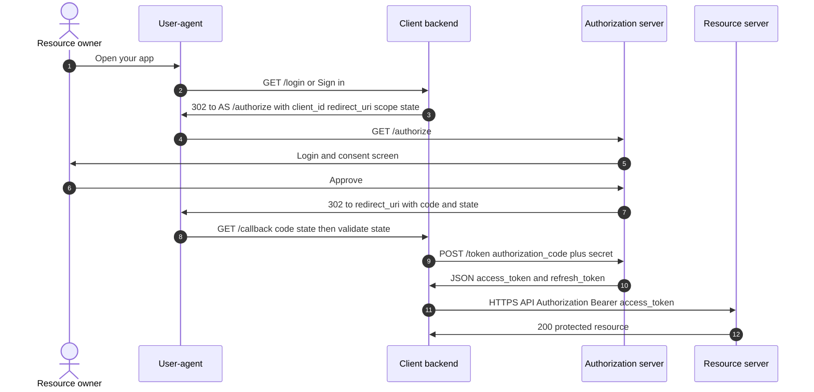
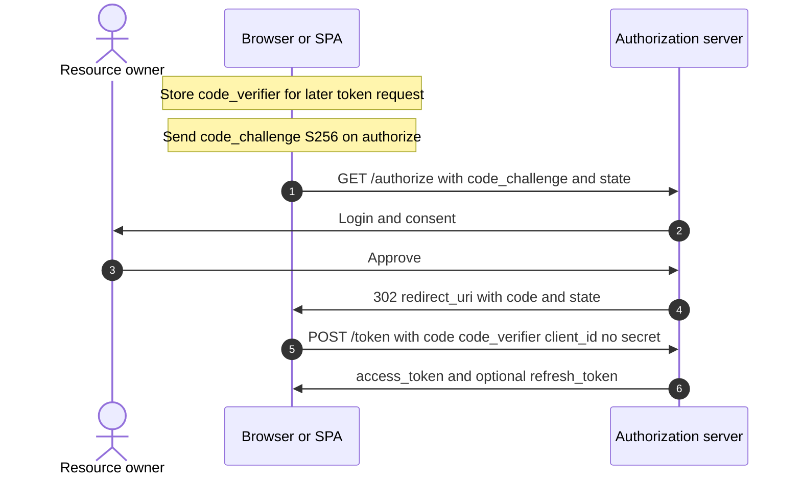
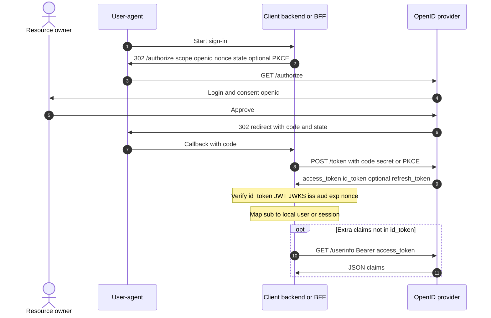
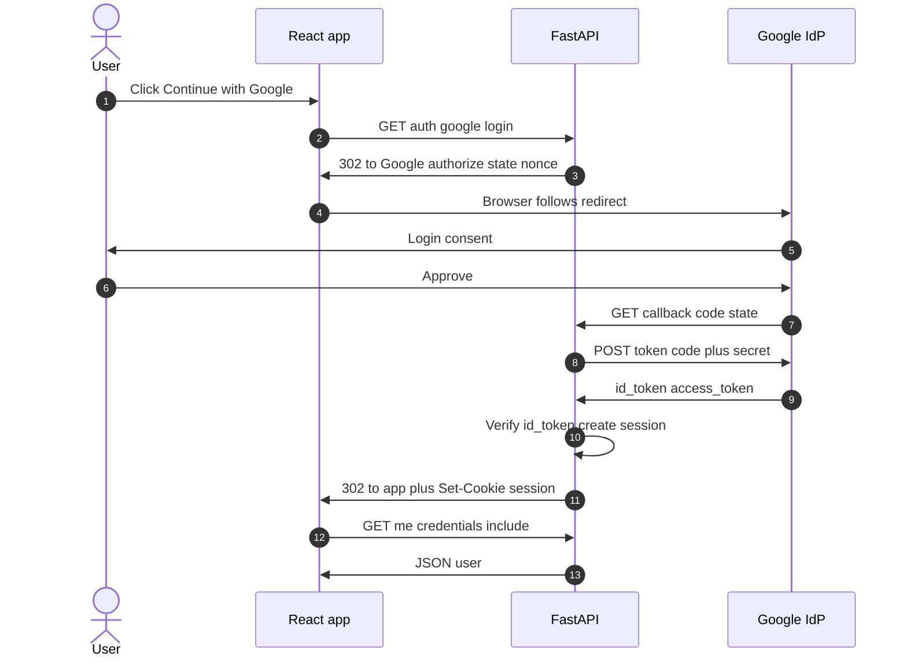

# Auth & security

**Authentication** (who you are) vs **authorization** (what you may do). Tokens, protocols, and deployment patterns—with minimal code patterns.

## Authentication

Verifying identity: passwords + MFA, API keys, TLS client certs, signed **JWT**s from your **OIDC** provider, etc. Produce a stable **principal** id (`sub`, `user_id`) for downstream **authorization**.

### Example (conceptual login result)

```json
{ "principal_id": "auth0|123", "mfa_level": "otp_ok" }
```

## Authorization

Enforcing policy after auth: RBAC (`role: admin`), ABAC, OAuth **scopes**, row-level security in Postgres, or OPA/Rego sidecars. Prefer failing closed and centralizing rules for **microservices**.

### Example (Flask-style pseudo)

```python
if not user.has_permission("invoice:write", invoice.org_id):
    return 403
```

## OAuth

**OAuth 2.0** is an *authorization* framework: clients obtain delegated **access token**s to call resource servers on a user’s behalf. It does **not** by itself standardize *who the user is*—that’s **OIDC**.

### Hosted platforms (Auth0, Okta, Clerk, Amazon Cognito, …)

Products like **Auth0** do **not** remove OAuth/OIDC concepts—they **implement** them for you and add UX and ops around them. What typically gets **easier**:

- **Dashboard + APIs** for applications, callbacks URLs, and connection toggles (**Google**, GitHub, enterprise SAML, etc.).
- **SDKs** (`@auth0/auth0-react`, Authlib, NextAuth patterns) that wrap redirects, **`state`/`nonce`**, and token handling—fewer chances to miswire URLs.
- **Hosted Universal Login**: Auth0’s pages run the **`/authorize`** experience so you ship fewer custom login forms.
- **Built-ins**: MFA policies, anomaly detection, brute-force mitigation, token rotation options—things you’d otherwise bolt on yourself.

What **stays your responsibility** (any vendor):

- Correct **redirect URIs**, **CORS**, and **cookie domains** between SPA and API.
- Knowing whether you store **sessions** vs **Bearer tokens** in the browser and the tradeoffs.
- **Secrets** (client secret for confidential apps), env separation, and validating **`id_token`** if you handle callbacks manually.

So Auth0 **streamlines implementation** and reduces footguns; the **mental model** (authorization server, client, code exchange, `id_token` for login) is the same.

### OAuth and OIDC vocabulary

| Term | Meaning |
|------|--------|
| **Authorization code (`code`)** | Short-lived, single-use string returned by the IdP on **`redirect_uri`** after the user approves. **Not** the access token. Your server exchanges it at **`POST /token`** with `client_id` (+ secret or PKCE). Anyone who steals it before redemption might finish the flow—hence **HTTPS**, short TTL, **PKCE** on public clients, and **`state`**. |
| **`state`** | **Opaque** random string **your client** generates before **`/authorize`** and stores (cookie/Redis). The IdP echoes it on redirect. You **must** compare callback `state` to stored value—binds the callback to the login your app started (**CSRF** mitigation). See [OAuth state checklist](#oauth-state-operational-checklist) below. |
| **`nonce`** | Random string sent on **`/authorize`** (OIDC); must appear inside the **`id_token`** JWT when verified. Stops **replay**: an attacker cannot reuse an old **`id_token`** from another context as if it belonged to this login attempt. |
| **Opaque (token)** | A token string whose **meaning is only known to the issuer**—usually verified by **introspection** (`POST /introspect`) or lookup server-side, not by decoding locally (contrast with **JWT**, self-contained if you have keys). “Opaque **`state`**” means “**meaningless blob** to everyone except your server,” not encrypted identity data. |
| **CSRF (cross-site request forgery)** | Attacker tricks a victim’s browser into **submitting a request** the victim did **not** intend (often using the victim’s existing cookies/session). In OAuth, **`state`** ties the returning **`code`** to **your** login initiation so an attacker cannot complete **their** authorization under **your** session. |

### IdP (identity provider)

Informal term for the system where users **sign in** and which mints tokens for your app. In practice your **IdP** is usually the same product as the OAuth **authorization server** and the OIDC **OpenID Provider** (e.g. Google, Auth0, Okta). “IdP” is not a separate OAuth role—it’s what people call that vendor **as a whole**.

### Authorization server vs resource server (example: Google)

The Google account UI and the **`/authorize`** + **`/token`** endpoints are the **authorization server** (and, with OIDC, the **OpenID Provider**). That stack is what products usually mean by integrating **Google sign-in**.

**Resource servers** are separate: HTTP APIs that **accept an access token** and enforce scopes—e.g. **Gmail API**, **Google Drive API**. The **access token** from the token response authorizes calls **on the user’s behalf** (reading mail, files, etc.).

For **sign-in only** (no Gmail/Drive integration), applications typically rely on the **`id_token`** and OIDC claims (**who** the user is) and then create an **application session**. The same OAuth machinery applies (**`code`**, **`/token`**, **`access_token`**); **identity** for login comes from the **OIDC** layer (`id_token`, `openid` scope, optional **UserInfo**). **access_token** is still the artifact meant for **calling APIs** (Google’s or your own).

RFC-ish actors (same party can be split across processes in real apps):

| Actor | Typical deployment |
|-------|---------------------|
| **Resource owner** | End user |
| **User-agent** | Browser / mobile WebView |
| **Client** | Your SPA, mobile app, or **backend** that holds `client_secret` (confidential) |
| **Authorization server** | IdP: login UI + consent + **`/authorize`** + **`/token`** (e.g. **Google** Identity, **Auth0**, **Okta**, **Azure AD**, **Keycloak**) |
| **Resource server** | Your API (or third-party API) that accepts the **access token** |

When you use **“Sign in with Google”** (OAuth/OIDC), **Google is the authorization server** for that flow: the Google account screen and the endpoints that mint the **`code`** and **tokens** are all that role. If you then call **Google APIs** (Gmail, Drive, Calendar), those APIs act as **resource servers** that accept Google-issued **access tokens** (with the right scopes). Your own backend API can also be a **resource server** for tokens your own IdP issued.

### Client (e.g. your backend) vs resource server

They are **different OAuth roles**, not necessarily different machines.

| | **Client** (confidential = your backend) | **Resource server** (your API or Google’s API) |
|---|-------------------------------------------|--------------------------------------------------|
| **Job** | Talks to the **authorization server**: redirect / `code` exchange, `client_id` + **`client_secret`** (or PKCE), receives **tokens** | **Protects resources**: incoming requests must carry a valid **access token**; checks signature / introspection, **scopes**, audience |
| **Typical routes** | `/login`, `/oauth/callback`, token refresh logic | `/api/...` returning business data |
| **Calls** | `POST` to IdP **`/token`**; may then call resource servers with `Authorization: Bearer …` | Does **not** run the Google login page; validates **Bearer** tokens **presented to it** |

**Same codebase can be both:** one process might expose `/auth/callback` (acting as **client**) and `/api/invoices` (acting as **resource server** for your own JWTs or tokens from your IdP). In **microservices**, a **BFF** is often the **client** to the IdP, while inner services are **resource servers** that trust tokens the BFF or gateway forwards.

If your product is only “Sign in with Google then **session cookie**,” your backend is mainly the **client** toward Google; your **HTML pages** are not really an OAuth resource server until you expose an API that expects **Bearer** access tokens.

### Example (authorization code flow — roles)

1. Browser → your app → redirect to IdP `/authorize?response_type=code&client_id=...&redirect_uri=...&scope=...&state=...`
2. User consents; IdP redirects back with `?code=...&state=...`
3. Your backend `POST /token` with `code`, `client_id`, `client_secret` (confidential client) or **PKCE** (public client)
4. You receive **access token** (and often **refresh token**); call APIs or establish **session**

### Sequence diagram — authorization code (confidential client)

`client_secret` stays on the **server**. The browser never sees it. After step 9 you usually create a **session** cookie or store tokens server-side.



### Sequence diagram — authorization code + PKCE (public client)

Typical for **SPA or native app**: no `client_secret`. The **code_verifier** proves the same app instance that started the flow exchanges the code. Many production SPAs use a **BFF** (backend-for-frontend) instead so tokens never sit in browser storage—then the middle steps look like the confidential diagram with a thin “token exchange” backend.



## OIDC (OpenID Connect)

Identity layer on top of OAuth 2.0: adds **`openid` scope**, **ID Token** (always a **JWT** with `iss`, `aud`, `sub`, `exp`, `iat`, optional `nonce`), **UserInfo** endpoint, and discovery (`/.well-known/openid-configuration`). Use OIDC for “Sign in with Google/Auth0/Okta”; use raw OAuth when you only need API delegation without identity claims.

### Sequence diagram — OIDC on the same OAuth flow

Same `/authorize` → `code` → `/token` dance; the token response **adds** **`id_token`** (JWT) for **authentication** (who signed in). **`access_token`** may still be opaque or JWT used for **API authorization**. **UserInfo** is optional extra claims beyond the ID token.



### Example (ID token claims — illustrative)

```json
{
  "iss": "https://accounts.google.com",
  "sub": "10769150350006150715113083767",
  "aud": "your-client-id.apps.googleusercontent.com",
  "exp": 1710000000,
  "iat": 1709996400,
  "email": "user@example.com",
  "email_verified": true
}
```

Validate: signature (JWKS), `iss`, `aud`, `exp`, and **`nonce`** if you sent one on `/authorize` (binds token to your session, mitigates replay).

### Example (decode + verify — use a library in production)

```python
# Use authlib, python-jose, or vendor SDKs — never skip signature verification
from authlib.integrations.requests_client import OAuth2Session  # example family
# fetch discovery, parse ID token with JWKS, validate claims
```

### Example walkthrough: React SPA + FastAPI + Google (OIDC)

End-to-end picture when **your users log into your product** with Google. Here FastAPI is the **OAuth client** (confidential): it keeps **`client_secret`** off the React bundle and completes the **authorization code** flow server-side. React is mostly the **user-agent** driving redirects and then calling your API with cookies.

#### One-time Google Cloud setup

1. Create a **Google Cloud** project → **APIs & Services** → **Credentials** → **Create credentials** → **OAuth client ID**.
2. Application type **Web application**. Add **Authorized redirect URIs** exactly matching your backend callback, e.g. `https://api.example.com/auth/google/callback` (not the React dev server URL unless you intentionally proxy).
3. Note **Client ID** and **Client secret**. Restrict OAuth consent screen (external vs internal) as appropriate.

#### Scopes for “login only”

Use at least **`openid email profile`** so the token response includes an **ID Token** with stable **`sub`** and usual profile/email claims. Add Google API scopes only if you need Gmail/Drive etc.

#### Components

| Piece | Role |
|-------|------|
| **React** (`https://app.example.com`) | UI; sends browser to FastAPI to start login; after login, stores **no secrets**; calls FastAPI with **`credentials: 'include'`** so session cookies are sent |
| **FastAPI** (`https://api.example.com`) | **OAuth/OIDC client**: builds `/authorize` URL, stores **`state`** (and optional **`nonce`**) server-side, **`POST /token`** with `code` + secret, **verifies `id_token`**, creates **session**, sets **httpOnly** cookie |
| **Google** | **Authorization server** + **OpenID Provider** |

#### Happy-path steps

1. User clicks **“Continue with Google”** in React → browser navigates to **`GET https://api.example.com/auth/google/login`** (full page navigation or `window.location.assign`).
2. FastAPI generates cryptographically random **`state`** and **`nonce`**, stores them (signed cookie, Redis, or server session) tied to the browser, then responds **`302`** to Google’s **`/authorize`** with `client_id`, `redirect_uri` (FastAPI callback URL), `response_type=code`, `scope=openid email profile`, `state`, `nonce`, `prompt=consent` only if you need it.
3. User signs in and consents on **Google**.
4. Google redirects browser to **`GET https://api.example.com/auth/google/callback?code=...&state=...`**.
5. FastAPI validates **`state`**, exchanges **`code`** at Google’s **`POST /token`** with `client_id`, **`client_secret`**, `redirect_uri`, `grant_type=authorization_code`.
6. Response includes **`id_token`**, **`access_token`**, optional **`refresh_token`**. FastAPI **verifies `id_token`** (JWKS signature, `iss`, `aud`, `exp`, **`nonce`**).
7. FastAPI maps **`sub`** (+ email if you trust `email_verified`) to an internal user row or creates one, then sets a **session** (opaque **session id** in **httpOnly** `Secure` `SameSite` cookie, or a signed session JWT cookie—your choice).
8. FastAPI responds **`302`** to **`https://app.example.com/app`** (or `/login/success`). React loads; user is logged in for your domain because of the **cookie on `api.example.com`** (see CORS note below).
9. React calls **`GET https://api.example.com/me`** with `fetch(url, { credentials: 'include' })`; FastAPI reads session, returns JSON user.

#### Cookie + CORS reality

Browser cookies are **domain-scoped**. If the session cookie is set on **`api.example.com`**, it is **not** sent to **`app.example.com`**. Typical fixes:

- **Same site, API under a path**: serve API and SPA from one origin (e.g. reverse proxy: `example.com` + `/api` → FastAPI). Cookie on `example.com` works for both.
- **Subdomains**: set cookie **`Domain=.example.com`** so both `app` and `api` receive it (still configure `Secure`, `SameSite=None` if cross-site rules apply—prefer same-site layouts to avoid third-party cookie issues).
- **BFF**: React talks only to same-origin `/api` which proxies to FastAPI (cookie always first-party).

#### Minimal React (start login + authenticated fetch)

```tsx
// Start login — full redirect so FastAPI can set state and redirect to Google
function LoginWithGoogle() {
  return (
    <a href={`${import.meta.env.VITE_API_URL}/auth/google/login`}>
      Continue with Google
    </a>
  );
}

// After login, call API with cookies
async function fetchMe() {
  const r = await fetch(`${import.meta.env.VITE_API_URL}/me`, {
    credentials: "include",
  });
  if (!r.ok) throw new Error("not logged in");
  return r.json();
}
```

#### Minimal FastAPI (shape only — use Authlib or similar in production)

```python
# Pseudocode — real apps: authlib OAuth2Session, redis for state, HTTPS only

@app.get("/auth/google/login")
async def google_login():
    state = secrets.token_urlsafe(32)
    nonce = secrets.token_urlsafe(32)
    # persist state+nonce (e.g. signed cookie or Redis keyed by state)
    url = (
        "https://accounts.google.com/o/oauth2/v2/auth"
        f"?client_id={CLIENT_ID}&redirect_uri={CALLBACK_URI}"
        "&response_type=code&scope=openid%20email%20profile"
        f"&state={state}&nonce={nonce}"
    )
    return RedirectResponse(url)

@app.get("/auth/google/callback")
async def google_callback(code: str, state: str):
    # validate state matches stored value
    token_response = await exchange_code_for_tokens(code)
    id_token = token_response["id_token"]
    claims = verify_google_id_token(id_token, nonce=expected_nonce)  # JWKS!
    user = upsert_user(claims["sub"], claims.get("email"))
    response = RedirectResponse(f"{FRONTEND_URL}/app")
    response.set_cookie("session", create_session_token(user), httponly=True, secure=True, samesite="lax")
    return response

@app.get("/me")
async def me(session: Session = Depends(get_session)):
    return {"user_id": session.user_id, "email": session.email}
```

#### Diagram (browser redirect flow, confidential client)



#### OAuth state (operational checklist)

See **[OAuth and OIDC vocabulary](#oauth-and-oidc-vocabulary)** for definitions of **`state`**, **opaque**, and **CSRF**.

**Who creates `state`:** The **OAuth client** (e.g. FastAPI **`/auth/google/login`**), never the IdP.

**Who verifies:** The **same client** on the IdP redirect to **`/callback`** when the query string contains **`?code=...&state=...`**.

**How:** Before **`/authorize`**, persist **`state`** (and usually **`nonce`**) so you can retrieve them when the browser returns:

- **Signed or httpOnly cookie** on `GET /login` holding `state` / `nonce`, read back on callback.
- **Server-side store** keyed by `state` (Redis) with TTL ~10 minutes: `{ state → nonce, optional metadata }`.
- **Encrypted state blob** in the callback URL (less common).

On callback: parse `state`; **reject** if missing, unknown, or expired; **compare** to stored value for **this** login attempt. On match, delete one-time entry (**replay** protection). On failure → **`400`** / redirect to login—do **not** exchange the **`code`**.

**Why:** Mitigates **CSRF / login confusion** (binding the returning **`code`** to the session that **started** OAuth).

#### Session cookie vs storing Google’s `id_token`

**Usually the cookie is not Google’s `id_token`.** Google’s **`id_token`** is a **JWT from Google** for **one-time verification** at **`/token`** time: validate signature (JWKS), **`aud`** (your client id), **`exp`**, **`nonce`**, then read **`sub`** / email and **issue your own session**.

Typical patterns for the **`Set-Cookie`** your API returns:

| Cookie contents | Meaning |
|-----------------|--------|
| **Opaque session id** | Random id; server looks up Redis/DB for `user_id`, expiry, roles. Common when you want easy revocation and logout. |
| **JWT signed by your app** | Claims like `{ "uid": "...", "exp": ... }` signed with **your** secret or asymmetric key—not Google’s key. Lets APIs verify without DB hit; revocation needs short TTL plus denylist or accept staleness. |

Storing Google’s raw **`id_token`** in a browser cookie is **unusual**: short-lived (~1h), minted for **your OAuth client** as OIDC proof, not designed as your long-lived API session. If you need Google **`access_token`** later (Calendar, Gmail), store **refresh/exchange logic server-side**, not only in the cookie.

**Summary:** **`id_token`** proves identity **once** when you finish OAuth; your **session cookie** proves identity **on each request** to **your** API—often a **different** token or opaque id, **issued by you** after you trust Google’s **`id_token`**.

#### Alternative: PKCE in the SPA

React runs **`/authorize`** with PKCE and receives **`code`** on `localhost` or SPA redirect URI, then either exchanges tokens **in the browser** (tokens in JS memory/storage—risky for refresh tokens) or sends **`code`** to FastAPI which exchanges it (**BFF**). Confidential FastAPI-only redirect avoids storing refresh tokens in the SPA entirely.

#### See also

[FastAPI](./12-python-web-stack.md#fastapi), [Session](#session), [PKCE](#pkce-proof-key-for-code-exchange).

## PKCE (proof key for code exchange)

**Yes — PKCE is part of OAuth 2.0.** It is defined in [RFC 7636](https://datatracker.ietf.org/doc/html/rfc7636) as an extension used with the **authorization code** grant. It is **not** a second login step after “initial login”; it wraps the **same** redirect-to-IdP flow, adding crypto so whoever receives the `code` cannot exchange it unless they also have the original **`code_verifier`**.

### Where it sits in time (one sign-in, end-to-end)

Think of it as **extra query/body parameters** on the two HTTP hops you already had for authorization code:

1. **Before redirecting the browser** — your app (usually the SPA or native shell) generates **`code_verifier`** (long random secret) and derives **`code_challenge`** = BASE64URL(SHA256(verifier)). It keeps **`code_verifier` in memory** (or secure storage), never sends it on the first hop.
2. **`GET /authorize`** — same as OAuth auth code, **plus** `code_challenge` and `code_challenge_method=S256` (with `client_id`, `redirect_uri`, `scope`, `state`, `response_type=code`). User signs in and consents **here** (that *is* the “login” from OAuth’s point of view).
3. **Redirect back** — same as without PKCE: `?code=...&state=...`.
4. **`POST /token`** — same endpoint as confidential clients, but the client sends **`code_verifier`** (and **no** `client_secret` for a public client). The IdP recomputes SHA256(verifier), compares to the challenge from step 2, then returns **`access_token`** (and optionally **`refresh_token`**, **`id_token`** if OIDC).

So PKCE runs **during** the first code exchange, **not** after you already have a session or access token. **Refresh token** grants are a **separate** later call (`grant_type=refresh_token`); PKCE does not repeat on every refresh unless your stack does a full new authorization (unusual for simple refresh).

### Why it exists

Without a **client secret**, an attacker who intercepts the **`code`** (open redirect, HTTP mitm, etc.) could call **`/token`** and impersonate the user. PKCE binds the **`code`** to the same instance that started **`/authorize`** by requiring the secret **`code_verifier`** at token time.

### Confidential client with secret

If your **backend** holds `client_secret` and exchanges the code server-side, you often still **use PKCE anyway** (defense in depth, BFF pattern, or policy). The critical case is **public clients** where PKCE is effectively **required** by modern practice.

### Example (values abbreviated)

```
GET /authorize?...&code_challenge=E9Melhoa2OwvFrEMTJguCHaoeK1t8URWbuGJSstw-cM&code_challenge_method=S256
POST /token  code_verifier=dBjftJeZ4CVP-mB92K27uhbUJU1p1r_wW1gFWFOEjXk
```

## Access token

Credential sent to resource APIs (`Authorization: Bearer ...`). Keep TTL short; scope narrowly. May be opaque (introspect at auth server) or a signed **JWT** (verify locally with JWKS).

## Refresh token

Long-lived, **only** sent to token endpoint to mint new access tokens. Store hashed server-side if you issue opaque refresh tokens; rotate on use (refresh token family) to detect theft.

### Example (refresh grant — pattern)

```http
POST /oauth2/token
Content-Type: application/x-www-form-urlencoded

grant_type=refresh_token&refresh_token=REF...&client_id=...
```

## Session

Server-side session store keyed by opaque cookie (`session_id`) or encrypted/signed cookie payload. Survives browser restarts until expiry. Scale-out needs **Redis**/DB session store or sticky routing (worse).

### Example (signed cookie idea — framework handles crypto)

```python
# Pseudocode: session cookie contains user_id + expiry, HMAC-signed
response.set_cookie("sid", signed_blob, httponly=True, secure=True, samesite="lax")
```

## JWT (JSON Web Token)

Three base64url segments: `header.payload.signature`. Claims carry identity/authorization hints. **Pros:** stateless verification, cross-service trust with shared JWKS. **Cons:** revocation is hard (short TTL + denylist for sensitive ops), tokens get large, secret rotation must be coordinated.

### Example (decode payload only — never trust without verify)

```python
import base64, json
def b64json(part):
    pad = "=" * (-len(part) % 4)
    return json.loads(base64.urlsafe_b64decode(part + pad))
# payload = b64json(token.split(".")[1])
```

Use **`exp`**, **`nbf`**, **`aud`**, **`iss`** checks with a proper library.

## Sticky sessions

Load balancer pins a client to one app instance (cookie or IP hash). Lets you keep in-memory **session**; complicates deploys and failover. Prefer external session store for **stateless services**.

## Session affinity

Same as **sticky sessions**: routing policy that maps a session identifier to a fixed backend target.
