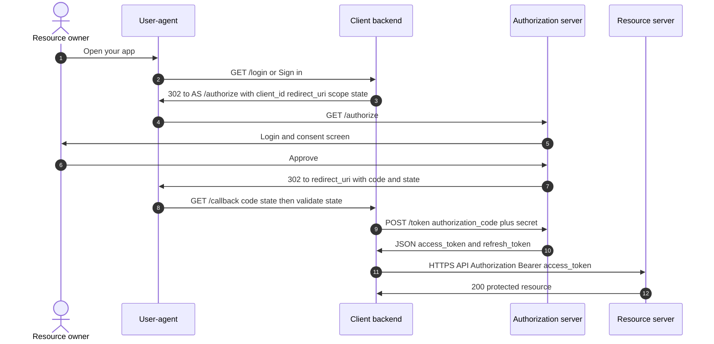
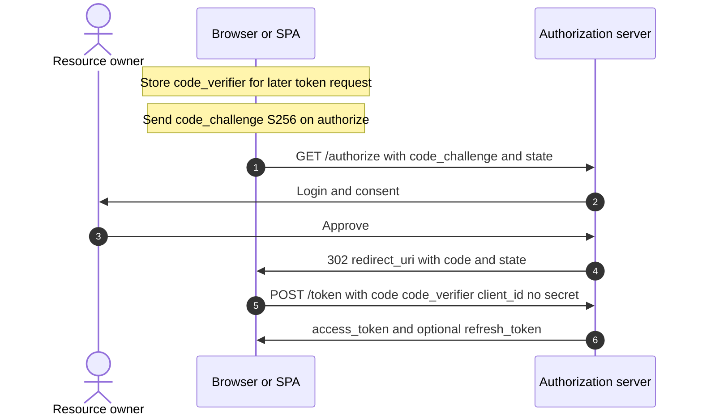
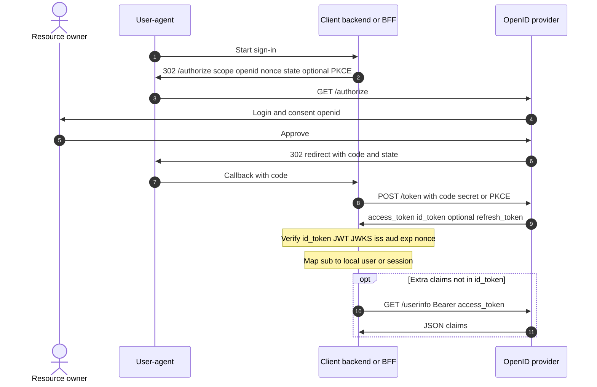

# Auth & security

**Authentication** (who you are) vs **authorization** (what you may do). Tokens, protocols, and deployment patterns—with minimal code patterns.

## Authentication

Verifying identity: passwords + MFA, API keys, TLS client certs, signed **JWT**s from your **OIDC** provider, etc. Produce a stable **principal** id (`sub`, `user_id`) for downstream **authorization**.

### Example (conceptual login result)

```json
{ "principal_id": "auth0|123", "mfa_level": "otp_ok" }
```

## Authorization

Enforcing policy after auth: RBAC (`role: admin`), ABAC, OAuth **scopes**, row-level security in Postgres, or OPA/Rego sidecars. Prefer failing closed and centralizing rules for **microservices**.

### Example (Flask-style pseudo)

```python
if not user.has_permission("invoice:write", invoice.org_id):
    return 403
```

## OAuth

**OAuth 2.0** is an *authorization* framework: clients obtain delegated **access token**s to call resource servers on a user’s behalf. It does **not** by itself standardize *who the user is*—that’s **OIDC**.

### IdP (identity provider)

Informal term for the system where users **sign in** and which mints tokens for your app. In practice your **IdP** is usually the same product as the OAuth **authorization server** and the OIDC **OpenID Provider** (e.g. Google, Auth0, Okta). “IdP” is not a separate OAuth role—it’s what people call that vendor **as a whole**.

### “Google Auth” — is that the resource server?

**No.** The account picker / consent screen and the **`/authorize`** + **`/token`** endpoints are the **authorization server** (and, with OIDC, the **OpenID Provider**). That’s what most people mean by **“Google Auth.”**

A **resource server** is an **HTTP API that consumes access tokens**—e.g. **Gmail API**, **Google Drive API**. You use the **access token** from the token response to call those APIs **on the user’s behalf** (delegated **authorization** to read mail, files, etc.).

For **“Sign in with Google” only** (no Gmail/Drive calls), you often care about **`id_token`** + OIDC claims (**who** the user is) and then create your own **session**. The **OAuth** machinery (code, token endpoint, **access_token**) is still the same pipeline; **identity** comes from the **OIDC** layer (`id_token`, `openid` scope, sometimes **UserInfo**), not from OAuth’s original “access token only” story.

So: you are not using “authorization instead of authentication” in a vacuum—**real products combine OAuth’s flow with OIDC (or similar) for login**, while **access_token** remains the thing meant for **calling APIs** (Google’s or yours).

RFC-ish actors (same party can be split across processes in real apps):

| Actor | Typical deployment |
|-------|---------------------|
| **Resource owner** | End user |
| **User-agent** | Browser / mobile WebView |
| **Client** | Your SPA, mobile app, or **backend** that holds `client_secret` (confidential) |
| **Authorization server** | IdP: login UI + consent + **`/authorize`** + **`/token`** (e.g. **Google** Identity, **Auth0**, **Okta**, **Azure AD**, **Keycloak**) |
| **Resource server** | Your API (or third-party API) that accepts the **access token** |

When you use **“Sign in with Google”** (OAuth/OIDC), **Google is the authorization server** for that flow: the Google account screen and the endpoints that mint the **`code`** and **tokens** are all that role. If you then call **Google APIs** (Gmail, Drive, Calendar), those APIs act as **resource servers** that accept Google-issued **access tokens** (with the right scopes). Your own backend API can also be a **resource server** for tokens your own IdP issued.

### Client (e.g. your backend) vs resource server

They are **different OAuth roles**, not necessarily different machines.

| | **Client** (confidential = your backend) | **Resource server** (your API or Google’s API) |
|---|-------------------------------------------|--------------------------------------------------|
| **Job** | Talks to the **authorization server**: redirect / `code` exchange, `client_id` + **`client_secret`** (or PKCE), receives **tokens** | **Protects resources**: incoming requests must carry a valid **access token**; checks signature / introspection, **scopes**, audience |
| **Typical routes** | `/login`, `/oauth/callback`, token refresh logic | `/api/...` returning business data |
| **Calls** | `POST` to IdP **`/token`**; may then call resource servers with `Authorization: Bearer …` | Does **not** run the Google login page; validates **Bearer** tokens **presented to it** |

**Same codebase can be both:** one process might expose `/auth/callback` (acting as **client**) and `/api/invoices` (acting as **resource server** for your own JWTs or tokens from your IdP). In **microservices**, a **BFF** is often the **client** to the IdP, while inner services are **resource servers** that trust tokens the BFF or gateway forwards.

If your product is only “Sign in with Google then **session cookie**,” your backend is mainly the **client** toward Google; your **HTML pages** are not really an OAuth resource server until you expose an API that expects **Bearer** access tokens.

### Example (authorization code flow — roles)

1. Browser → your app → redirect to IdP `/authorize?response_type=code&client_id=...&redirect_uri=...&scope=...&state=...`
2. User consents; IdP redirects back with `?code=...&state=...`
3. Your backend `POST /token` with `code`, `client_id`, `client_secret` (confidential client) or **PKCE** (public client)
4. You receive **access token** (and often **refresh token**); call APIs or establish **session**

### Sequence diagram — authorization code (confidential client)

`client_secret` stays on the **server**. The browser never sees it. After step 9 you usually create a **session** cookie or store tokens server-side.



### Sequence diagram — authorization code + PKCE (public client)

Typical for **SPA or native app**: no `client_secret`. The **code_verifier** proves the same app instance that started the flow exchanges the code. Many production SPAs use a **BFF** (backend-for-frontend) instead so tokens never sit in browser storage—then the middle steps look like the confidential diagram with a thin “token exchange” backend.



## OIDC (OpenID Connect)

Identity layer on top of OAuth 2.0: adds **`openid` scope**, **ID Token** (always a **JWT** with `iss`, `aud`, `sub`, `exp`, `iat`, optional `nonce`), **UserInfo** endpoint, and discovery (`/.well-known/openid-configuration`). Use OIDC for “Sign in with Google/Auth0/Okta”; use raw OAuth when you only need API delegation without identity claims.

### Sequence diagram — OIDC on the same OAuth flow

Same `/authorize` → `code` → `/token` dance; the token response **adds** **`id_token`** (JWT) for **authentication** (who signed in). **`access_token`** may still be opaque or JWT used for **API authorization**. **UserInfo** is optional extra claims beyond the ID token.



### Example (ID token claims — illustrative)

```json
{
  "iss": "https://accounts.google.com",
  "sub": "10769150350006150715113083767",
  "aud": "your-client-id.apps.googleusercontent.com",
  "exp": 1710000000,
  "iat": 1709996400,
  "email": "user@example.com",
  "email_verified": true
}
```

Validate: signature (JWKS), `iss`, `aud`, `exp`, and **`nonce`** if you sent one on `/authorize` (binds token to your session, mitigates replay).

### Example (decode + verify — use a library in production)

```python
# Use authlib, python-jose, or vendor SDKs — never skip signature verification
from authlib.integrations.requests_client import OAuth2Session  # example family
# fetch discovery, parse ID token with JWKS, validate claims
```

## PKCE (proof key for code exchange)

**Yes — PKCE is part of OAuth 2.0.** It is defined in [RFC 7636](https://datatracker.ietf.org/doc/html/rfc7636) as an extension used with the **authorization code** grant. It is **not** a second login step after “initial login”; it wraps the **same** redirect-to-IdP flow, adding crypto so whoever receives the `code` cannot exchange it unless they also have the original **`code_verifier`**.

### Where it sits in time (one sign-in, end-to-end)

Think of it as **extra query/body parameters** on the two HTTP hops you already had for authorization code:

1. **Before redirecting the browser** — your app (usually the SPA or native shell) generates **`code_verifier`** (long random secret) and derives **`code_challenge`** = BASE64URL(SHA256(verifier)). It keeps **`code_verifier` in memory** (or secure storage), never sends it on the first hop.
2. **`GET /authorize`** — same as OAuth auth code, **plus** `code_challenge` and `code_challenge_method=S256` (with `client_id`, `redirect_uri`, `scope`, `state`, `response_type=code`). User signs in and consents **here** (that *is* the “login” from OAuth’s point of view).
3. **Redirect back** — same as without PKCE: `?code=...&state=...`.
4. **`POST /token`** — same endpoint as confidential clients, but the client sends **`code_verifier`** (and **no** `client_secret` for a public client). The IdP recomputes SHA256(verifier), compares to the challenge from step 2, then returns **`access_token`** (and optionally **`refresh_token`**, **`id_token`** if OIDC).

So PKCE runs **during** the first code exchange, **not** after you already have a session or access token. **Refresh token** grants are a **separate** later call (`grant_type=refresh_token`); PKCE does not repeat on every refresh unless your stack does a full new authorization (unusual for simple refresh).

### Why it exists

Without a **client secret**, an attacker who intercepts the **`code`** (open redirect, HTTP mitm, etc.) could call **`/token`** and impersonate the user. PKCE binds the **`code`** to the same instance that started **`/authorize`** by requiring the secret **`code_verifier`** at token time.

### Confidential client with secret

If your **backend** holds `client_secret` and exchanges the code server-side, you often still **use PKCE anyway** (defense in depth, BFF pattern, or policy). The critical case is **public clients** where PKCE is effectively **required** by modern practice.

### Example (values abbreviated)

```
GET /authorize?...&code_challenge=E9Melhoa2OwvFrEMTJguCHaoeK1t8URWbuGJSstw-cM&code_challenge_method=S256
POST /token  code_verifier=dBjftJeZ4CVP-mB92K27uhbUJU1p1r_wW1gFWFOEjXk
```

## Access token

Credential sent to resource APIs (`Authorization: Bearer ...`). Keep TTL short; scope narrowly. May be opaque (introspect at auth server) or a signed **JWT** (verify locally with JWKS).

## Refresh token

Long-lived, **only** sent to token endpoint to mint new access tokens. Store hashed server-side if you issue opaque refresh tokens; rotate on use (refresh token family) to detect theft.

### Example (refresh grant — pattern)

```http
POST /oauth2/token
Content-Type: application/x-www-form-urlencoded

grant_type=refresh_token&refresh_token=REF...&client_id=...
```

## Session

Server-side session store keyed by opaque cookie (`session_id`) or encrypted/signed cookie payload. Survives browser restarts until expiry. Scale-out needs **Redis**/DB session store or sticky routing (worse).

### Example (signed cookie idea — framework handles crypto)

```python
# Pseudocode: session cookie contains user_id + expiry, HMAC-signed
response.set_cookie("sid", signed_blob, httponly=True, secure=True, samesite="lax")
```

## JWT (JSON Web Token)

Three base64url segments: `header.payload.signature`. Claims carry identity/authorization hints. **Pros:** stateless verification, cross-service trust with shared JWKS. **Cons:** revocation is hard (short TTL + denylist for sensitive ops), tokens get large, secret rotation must be coordinated.

### Example (decode payload only — never trust without verify)

```python
import base64, json
def b64json(part):
    pad = "=" * (-len(part) % 4)
    return json.loads(base64.urlsafe_b64decode(part + pad))
# payload = b64json(token.split(".")[1])
```

Use **`exp`**, **`nbf`**, **`aud`**, **`iss`** checks with a proper library.

## Sticky sessions

Load balancer pins a client to one app instance (cookie or IP hash). Lets you keep in-memory **session**; complicates deploys and failover. Prefer external session store for **stateless services**.

## Session affinity

Same as **sticky sessions**: routing policy that maps a session identifier to a fixed backend target.
