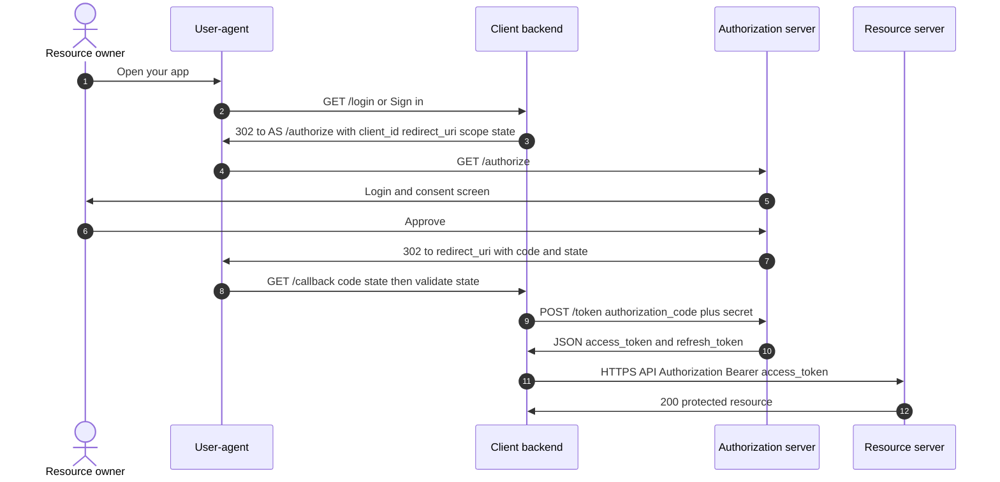
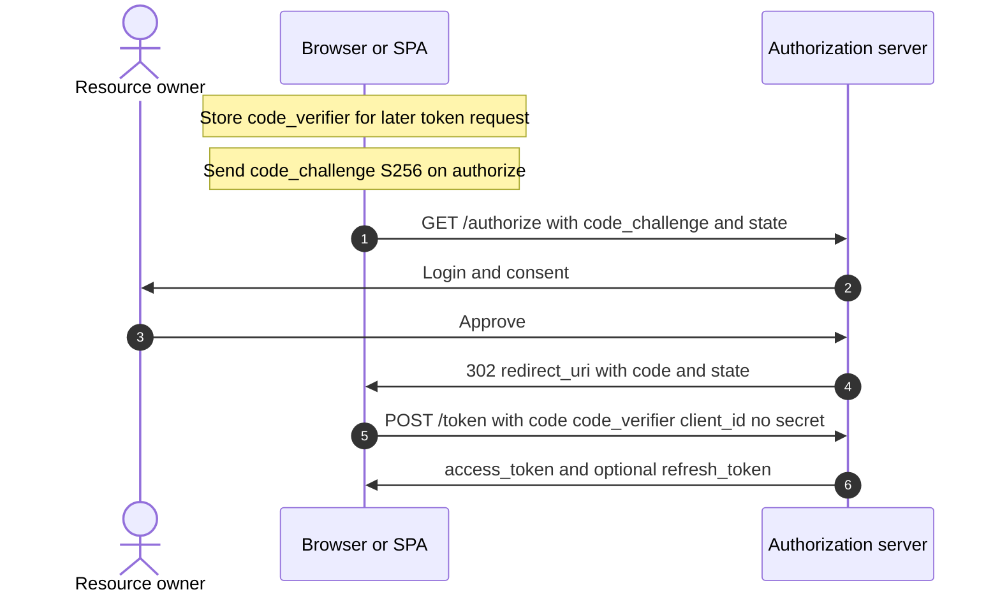
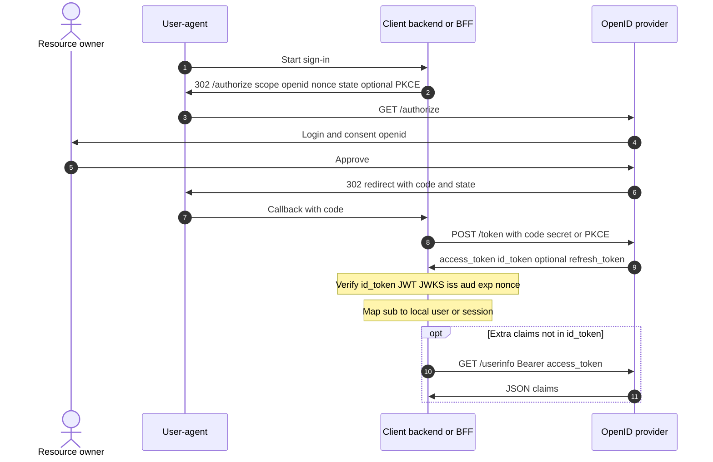

# Auth & security

**Authentication** (who you are) vs **authorization** (what you may do). Tokens, protocols, and deployment patterns—with minimal code patterns.

## Authentication

Verifying identity: passwords + MFA, API keys, TLS client certs, signed **JWT**s from your **OIDC** provider, etc. Produce a stable **principal** id (`sub`, `user_id`) for downstream **authorization**.

### Example (conceptual login result)

```json
{ "principal_id": "auth0|123", "mfa_level": "otp_ok" }
```

## Authorization

Enforcing policy after auth: RBAC (`role: admin`), ABAC, OAuth **scopes**, row-level security in Postgres, or OPA/Rego sidecars. Prefer failing closed and centralizing rules for **microservices**.

### Example (Flask-style pseudo)

```python
if not user.has_permission("invoice:write", invoice.org_id):
    return 403
```

## OAuth

**OAuth 2.0** is an *authorization* framework: clients obtain delegated **access token**s to call resource servers on a user’s behalf. It does **not** by itself standardize *who the user is*—that’s **OIDC**.

RFC-ish actors (same party can be split across processes in real apps):

| Actor | Typical deployment |
|-------|---------------------|
| **Resource owner** | End user |
| **User-agent** | Browser / mobile WebView |
| **Client** | Your SPA, mobile app, or **backend** that holds `client_secret` (confidential) |
| **Authorization server** | IdP login + consent + `/authorize` + `/token` |
| **Resource server** | Your API (or third-party API) that accepts the **access token** |

### Example (authorization code flow — roles)

1. Browser → your app → redirect to IdP `/authorize?response_type=code&client_id=...&redirect_uri=...&scope=...&state=...`
2. User consents; IdP redirects back with `?code=...&state=...`
3. Your backend `POST /token` with `code`, `client_id`, `client_secret` (confidential client) or **PKCE** (public client)
4. You receive **access token** (and often **refresh token**); call APIs or establish **session**

### Sequence diagram — authorization code (confidential client)

`client_secret` stays on the **server**. The browser never sees it. After step 9 you usually create a **session** cookie or store tokens server-side.



### Sequence diagram — authorization code + PKCE (public client)

Typical for **SPA or native app**: no `client_secret`. The **code_verifier** proves the same app instance that started the flow exchanges the code. Many production SPAs use a **BFF** (backend-for-frontend) instead so tokens never sit in browser storage—then the middle steps look like the confidential diagram with a thin “token exchange” backend.



## OIDC (OpenID Connect)

Identity layer on top of OAuth 2.0: adds **`openid` scope**, **ID Token** (always a **JWT** with `iss`, `aud`, `sub`, `exp`, `iat`, optional `nonce`), **UserInfo** endpoint, and discovery (`/.well-known/openid-configuration`). Use OIDC for “Sign in with Google/Auth0/Okta”; use raw OAuth when you only need API delegation without identity claims.

### Sequence diagram — OIDC on the same OAuth flow

Same `/authorize` → `code` → `/token` dance; the token response **adds** **`id_token`** (JWT) for **authentication** (who signed in). **`access_token`** may still be opaque or JWT used for **API authorization**. **UserInfo** is optional extra claims beyond the ID token.



### Example (ID token claims — illustrative)

```json
{
  "iss": "https://accounts.google.com",
  "sub": "10769150350006150715113083767",
  "aud": "your-client-id.apps.googleusercontent.com",
  "exp": 1710000000,
  "iat": 1709996400,
  "email": "user@example.com",
  "email_verified": true
}
```

Validate: signature (JWKS), `iss`, `aud`, `exp`, and **`nonce`** if you sent one on `/authorize` (binds token to your session, mitigates replay).

### Example (decode + verify — use a library in production)

```python
# Use authlib, python-jose, or vendor SDKs — never skip signature verification
from authlib.integrations.requests_client import OAuth2Session  # example family
# fetch discovery, parse ID token with JWKS, validate claims
```

## PKCE (proof key for code exchange)

For **public clients** (SPA, mobile) that cannot hold a `client_secret`. Generate random `code_verifier`, send `code_challenge = BASE64URL(SHA256(verifier))` on `/authorize`, send `code_verifier` on `/token`. Prevents stolen `code` from being exchanged without the original app instance.

### Example (values abbreviated)

```
GET /authorize?...&code_challenge=E9Melhoa2OwvFrEMTJguCHaoeK1t8URWbuGJSstw-cM&code_challenge_method=S256
POST /token  code_verifier=dBjftJeZ4CVP-mB92K27uhbUJU1p1r_wW1gFWFOEjXk
```

## Access token

Credential sent to resource APIs (`Authorization: Bearer ...`). Keep TTL short; scope narrowly. May be opaque (introspect at auth server) or a signed **JWT** (verify locally with JWKS).

## Refresh token

Long-lived, **only** sent to token endpoint to mint new access tokens. Store hashed server-side if you issue opaque refresh tokens; rotate on use (refresh token family) to detect theft.

### Example (refresh grant — pattern)

```http
POST /oauth2/token
Content-Type: application/x-www-form-urlencoded

grant_type=refresh_token&refresh_token=REF...&client_id=...
```

## Session

Server-side session store keyed by opaque cookie (`session_id`) or encrypted/signed cookie payload. Survives browser restarts until expiry. Scale-out needs **Redis**/DB session store or sticky routing (worse).

### Example (signed cookie idea — framework handles crypto)

```python
# Pseudocode: session cookie contains user_id + expiry, HMAC-signed
response.set_cookie("sid", signed_blob, httponly=True, secure=True, samesite="lax")
```

## JWT (JSON Web Token)

Three base64url segments: `header.payload.signature`. Claims carry identity/authorization hints. **Pros:** stateless verification, cross-service trust with shared JWKS. **Cons:** revocation is hard (short TTL + denylist for sensitive ops), tokens get large, secret rotation must be coordinated.

### Example (decode payload only — never trust without verify)

```python
import base64, json
def b64json(part):
    pad = "=" * (-len(part) % 4)
    return json.loads(base64.urlsafe_b64decode(part + pad))
# payload = b64json(token.split(".")[1])
```

Use **`exp`**, **`nbf`**, **`aud`**, **`iss`** checks with a proper library.

## Sticky sessions

Load balancer pins a client to one app instance (cookie or IP hash). Lets you keep in-memory **session**; complicates deploys and failover. Prefer external session store for **stateless services**.

## Session affinity

Same as **sticky sessions**: routing policy that maps a session identifier to a fixed backend target.
